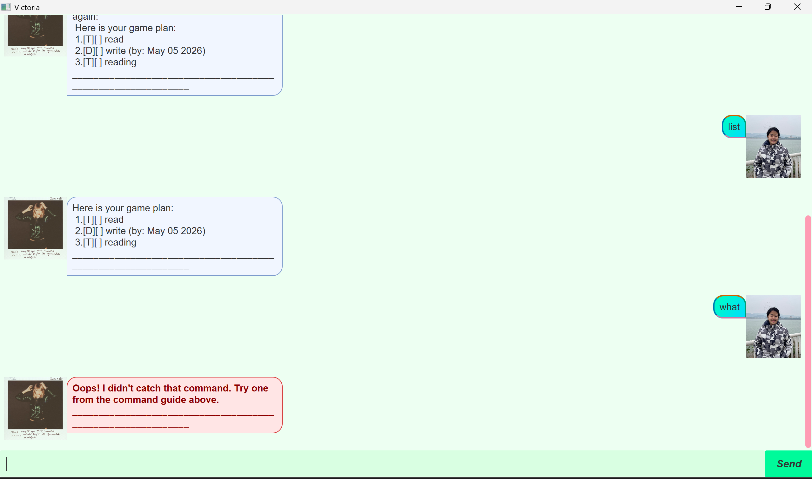

# Victoria User Guide

**Victoria** is a cheerful task-management chatbot. Use the chat box to keep track of to-dos, deadlines, and events; type a command and press Enter to send it.



## Quick start

Start Victoria, then type a command in the input box and press Enter. Commands must be in lowercase. For example:

```
todo Buy groceries
deadline Submit assignment /by 2026-09-20
event Team meeting /from 2026-09-15 /to 2026-09-15
list
```

In command formats below, text in `<angle brackets>` is information you provide. Dates must use the `yyyy-MM-dd` format, for example `2026-09-12`.

## Features

### Add a to-do: `todo`

Adds a task with no date.

Format: `todo <description>`

Example: `todo Buy groceries`

### Add a deadline: `deadline`

Adds a task due on a specific date.

Format: `deadline <description> /by <date>`

Example: `deadline Submit assignment /by 2026-09-20`

### Add an event: `event`

Adds a task that takes place from one date to another, inclusive.

Format: `event <description> /from <start date> /to <end date>`

Example: `event Team meeting /from 2026-09-15 /to 2026-09-17`

### View tasks: `list`

Shows every task, including its number and completion status.

Format: `list`

To see deadlines and events scheduled on one date, use `list on <date>`. An event is shown for every date from its start through its end.

Example: `list on 2026-09-15`

### Find tasks: `find`

Finds tasks whose descriptions contain the keyword or phrase. Matching ignores letter case.

Format: `find <keyword>`

Example: `find assignment`

### Mark a task as done: `mark`

Marks the numbered task as complete. Use the number shown by `list` or `find`.

Format: `mark <number>`

Example: `mark 2`

### Mark a task as not done: `unmark`

Returns a completed task to the not-done state.

Format: `unmark <number>`

Example: `unmark 2`

### Delete a task: `delete`

Permanently removes the numbered task. Check `list` first if you are unsure of its number.

Format: `delete <number>`

Example: `delete 2`

### Exit Victoria: `bye`

Closes the current session.

Format: `bye`

## Saving your tasks

Victoria automatically saves your task list after every successful command. When you start it again, your saved tasks are restored from `data/victoria.txt`; no manual save is needed.
